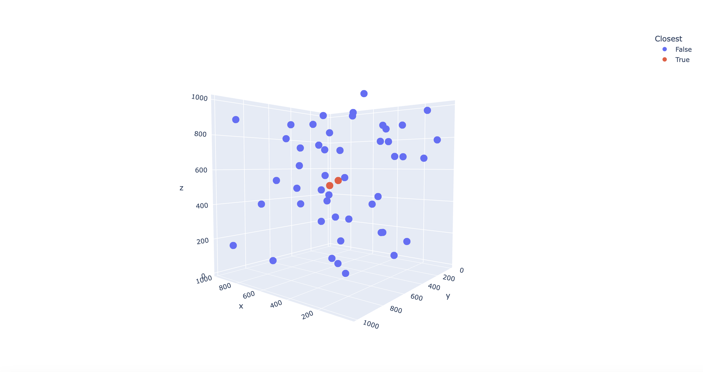

# Tucil2_13521130_13521133
Tugas Kecil 2 Strategi Algoritma <br>
IF2211 STRATEGI ALGORITMA <br>
Mencari Pasangan Titik Terdekat 3D 
Menggunakan Algoritma Divide and Conquer <br>

## Daftar Isi

- [Penjelasan Ringkas Program](#penjelasan-ringkas-program)
- [Penjelasan Algoritma](#penjelasan-algoritma)
- [Pre-Requisite](#pre-requisite)
- [Cara Menjalankan Program](#cara-menjalankan-program)
- [Screenshot Hasil Pengujian](#screenshot-hasil-pengujian)
- [Struktur Program](#struktur-program)
- [Kontributor](#kontributor)

## Penjelasan Ringkas Program

Pada tugas ini, diharapkan dapat dihasilkan luaran program sederhana yang dapat mencari sepasang titik terdekat dari sekumpulan n titik pada bidang 3 dimensi. Penyelesaian masalah ini dapat dilakukan dengan melakukan eksplorasi algorima menggunakan algoritma divide and conquer. Untuk memastikan efektivitas penggunaan algoritma ini, hasil penyelesaian selanjutnya dibandingkan dengan penyelesaian yang dilakukan menggunakan algoritma brute force. Selain pada bidang 3 dimensi, penyelesaian masalah juga diharapkan dapat mencakup titik-titik pada bidang multidimensi. Hasil dari titik-titik itu juga perlu diproyeksikan dalam bentuk grafik sehingga memudahkan penentuan kebenaran dari algoritma perhitungan yang dilakukan.

## Penjelasan Algoritma

Algoritma divide and conquer dilakukan dengan memeriksa apakah jumlah kurang dari sama dengan tiga. Apabila jumlah titik <= 3 maka akan digunakan algoritma brute force untuk mencari titik terdekat. Apabila jumlah titik lebih dari tiga program akan membagi himpunan titik menjadi dua sisi. Kemudian secara rekursif akan memanggil algoritma divide and conquer untuk mencari pasangan titik terdekat tiap sisi. Pada proses penggabungan solusi terdapat tiga kemungkinan solusi sepasang titik terdekat yaitu: (1) sepasang titik terdekat terdapat pada bagian satu, (2) sepasang titik terdekat terdapat pada bagian dua, atau (3) sepasang titik terdekat tepisah pada bagian satu dan dua. Pertama-tama sepasang titik terdekat pada bagian satu dan sepasang titik terdekat pada bagian dua dibandingkan mana yang paling dekat dan disimpan sebagai titik terdekat sementara. Untuk menangani kasus apabila sepasang titik terpisah pada bagian satu dan dua akan dilakukan pencarian titik yang memiliki jarak tiap axis lebih kecil dari jarak terdekat sementara. Titik-titik tersebut kemudian akan dibandingkan jaraknya apakah lebih kecil dari jarak terdekat sementara dan di dapatkanlah sepasang titik terdekat.

## Pre-Requisite
* Python 3.9.12, dapat diunduh melalui `https://www.python.org/downloads/`
* Library random, math, time, numpy, pandas, dan plotly, dapat diunduh dengan mengikuti langkah-langkah pada laman 'https://packaging.python.org/en/latest/tutorials/installing-packages/'

## Cara Menjalankan Program
1. Pastikan semua prerequisit telah dipenuhi, kemudian buka terminal pada directory program, kemudian masukkan perintah 'python3 src/main.py'
2. Masukkan jumlah titik yang diinginkan pada terminal
3. Masukkan dimensi titik yang diinginkan pada terminal
4. Hasil akan dicetak pada terminal kemudian ditampilkan laman HTML grafik dari titik-titik yang telah digenerate

## Screenshot Hasil Pengujian



## Struktur Program

```bash
└───Tubes_greed.axio
    ├───doc
    │   └───LaporanTucil2.pdf
    ├───src
    │   ├───closestPair.py
    │   ├───main.py
    │   ├───visualisasi.py
    │   └───Main.java
    ├───plot.png
    └───README.md
```

## Kontributor

13521130 Althaaf Khasyi Atisomya <br>
13521133 Cetta Reswara Parahita
